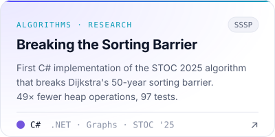
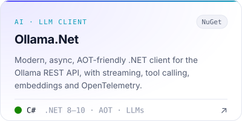
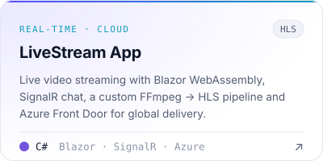
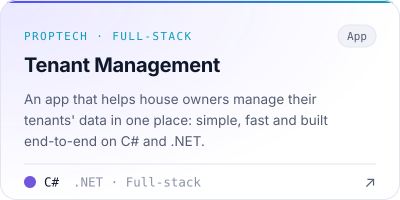

<!--
  Chethan D V · GitHub profile
  Static art:  python scripts/static_assets.py   → assets/
  Live stats:  .github/workflows/profile-stats.yml → profile-stats branch (daily)
-->

<div align="center">
  <picture>
    <source media="(prefers-color-scheme: dark)" srcset="assets/hero-dark.svg" />
    
  </picture>

  <br/>

  <a href="https://www.linkedin.com/in/chethan-d-v-aa4a55174/"></a>
  <a href="mailto:chethandvg3@gmail.com"></a>
  
  
</div>

<picture>
  <source media="(prefers-color-scheme: dark)" srcset="assets/divider-dark.svg" />
  
</picture>

### About

I'm a software engineer who likes turning complex problems into simple, fast systems. Most days that means **C# and .NET** on the backend, **Blazor** on the front, and **Azure** underneath. I also have an M.Sc. in Computer Science focused on **Big Data & AI**, so I build data and ML pipelines that ship to production, not just notebooks.

<table>
  <tr>
    <td width="33%" valign="top">
      <b>Building</b><br/>
      <sub>Full-stack .NET platforms, headless commerce integrations and real-time cloud apps.</sub>
    </td>
    <td width="33%" valign="top">
      <b>Exploring</b><br/>
      <sub>LLM tooling for .NET, AOT-friendly libraries and graph algorithms from recent research.</sub>
    </td>
    <td width="33%" valign="top">
      <b>Looking for</b><br/>
      <sub>Ambitious teams and remote roles where engineering quality really matters.</sub>
    </td>
  </tr>
</table>

### Featured work

<table>
  <tr>
    <td width="50%">
      <a href="https://github.com/chethandvg/breaking-the-sorting-barrier">
        <picture>
          <source media="(prefers-color-scheme: dark)" srcset="assets/project-sorting-barrier-dark.svg" />
          
        </picture>
      </a>
    </td>
    <td width="50%">
      <a href="https://github.com/chethandvg/Ollama.Net">
        <picture>
          <source media="(prefers-color-scheme: dark)" srcset="assets/project-ollama-net-dark.svg" />
          
        </picture>
      </a>
    </td>
  </tr>
  <tr>
    <td width="50%">
      <a href="https://github.com/chethandvg/LiveStreamApp">
        <picture>
          <source media="(prefers-color-scheme: dark)" srcset="assets/project-livestream-dark.svg" />
          
        </picture>
      </a>
    </td>
    <td width="50%">
      <a href="https://github.com/chethandvg/tenant-management">
        <picture>
          <source media="(prefers-color-scheme: dark)" srcset="assets/project-tenant-management-dark.svg" />
          
        </picture>
      </a>
    </td>
  </tr>
</table>

### Stack

<picture>
  <source media="(prefers-color-scheme: dark)" srcset="https://skillicons.dev/icons?i=cs,dotnet,python,js,html,css,azure,docker,postgres,mysql,githubactions,git,visualstudio,vscode&theme=dark&perline=15" />
  
</picture>

<sub>
  <b>Also:</b>
  Blazor · ASP.NET MVC · .NET MAUI · Entity Framework · Azure Databricks · PySpark · Azure DevOps · Contentful · commercetools · Algolia · SignalR · FFmpeg
</sub>

### Activity

<picture>
  <source media="(prefers-color-scheme: dark)" srcset="https://raw.githubusercontent.com/chethandvg/chethandvg/profile-stats/overview-dark.svg" />
  
</picture>

<picture>
  <source media="(prefers-color-scheme: dark)" srcset="https://raw.githubusercontent.com/chethandvg/chethandvg/profile-stats/landscape-dark.svg" />
  
</picture>

<picture>
  <source media="(prefers-color-scheme: dark)" srcset="https://raw.githubusercontent.com/chethandvg/chethandvg/profile-stats/languages-dark.svg" />
  
</picture>

<picture>
  <source media="(prefers-color-scheme: dark)" srcset="https://raw.githubusercontent.com/chethandvg/chethandvg/output/github-contribution-grid-snake-dark.svg" />
  
</picture>

### Experience

```yaml
role: Software Engineer
highlights:
  - Full-stack web apps with C#, .NET and Blazor, from schema to UI
  - RESTful APIs serving daily active users in production
  - Headless commerce: Contentful, commercetools and Algolia integrations
  - ML pipelines for predictive analytics on Azure Databricks + PySpark
  - CI/CD with GitHub Actions and Azure DevOps
```

<picture>
  <source media="(prefers-color-scheme: dark)" srcset="assets/divider-dark.svg" />
  
</picture>

<div align="center">
  <sub>Let's build something great together, <a href="https://www.linkedin.com/in/chethan-d-v-aa4a55174/">say hello on LinkedIn</a> or <a href="mailto:chethandvg3@gmail.com">by email</a>.</sub>
</div>
